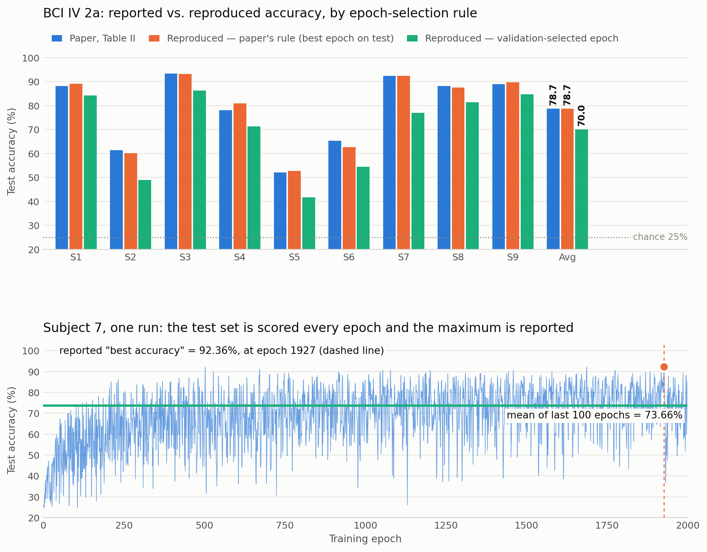

# Reproduction: epoch-selection protocols on BCI IV 2a

This directory reproduces the BCI IV 2a (Dataset I) result of

> Y. Song, Q. Zheng, B. Liu, X. Gao, *EEG Conformer: Convolutional Transformer for
> EEG Decoding and Visualization*, IEEE TNSRE 31:710–719, 2023

under three epoch-selection rules, in order to report the two numbers the released
code does not print: **the mean test accuracy over the last 100 epochs** and **the test
accuracy at the epoch chosen by a held-out validation set**.

The model definition and the training loop in `code/run_validation.py` are copied
verbatim from `conformer.py` (lines 66–410 of the released file). Every line that
differs is marked with a `# [MOD]` comment. No hyperparameter, layer, augmentation or
optimizer setting was changed: batch 72, Adam(lr 2e-4, β 0.5/0.999), 2000 epochs,
segmentation-and-recombination augmentation, depth 6, emb 40.

## Why this branch exists

`conformer.py` evaluates the **test** set once per epoch, keeps a running `bestAcc`, and
reports that maximum:

```python
if acc > bestAcc:
    bestAcc = acc
```

With 2000 evaluations of a 288-trial test set and no validation split, that maximum is
a selection statistic, not a held-out estimate. This directory measures how much of the
reported accuracy comes from the selection rule rather than the model.

## Protocols

| Tag | Training data | Reported epoch | Runs |
|-----|---------------|----------------|------|
| **A** | all 288 trials of session T | released rule — `max` over 2000 test evaluations; also the last-100-epoch mean, the final epoch, and the all-epoch mean | 9 subjects × 3 seeds = 27 |
| **B** | 80% of session T (20% held out) | epoch with the highest **validation** accuracy; test accuracy read off at that epoch | 9 subjects × 3 seeds = 27 |
| **C** | session T with training labels scrambled | released rule, as a floor for the selection procedure | 6 subjects × 3 seeds = 18 |

Seeds 2023 / 2024 / 2025. Protocol A is bit-for-bit the released procedure; B and C
differ from A only by the validation split and the label permutation respectively.

**Only two of the four headline numbers are separate training runs.** The last-100-epoch
mean is not its own experiment and has no flag: it is a different reduction of the same
protocol-A run, because `run_validation.py` stores test accuracy at *every* epoch rather
than only the maximum. The validation-selected number does need its own run, since
holding out 20% of session T changes what the model trains on.

```
protocol A run  ->  curve['test']  -+-  .max()          -> 78.72%  released rule
                                    +-  [-100:].mean()  -> 68.77%  last-100 mean
                                    +-  [-1]            -> 69.21%  final epoch

protocol B run  ->  curve['test'][argmax(curve['val'])] -> 70.01%  validation-selected
```

## Results

Grand mean over the 9 subjects (κ computed from the grand-mean accuracy, 4-class):

| Selection rule | Accuracy (%) | κ |
|---|---|---|
| Paper, Table II | 78.66 | 0.7155 |
| **A** — max over 2000 test evaluations (released rule) | **78.72** | 0.7162 |
| **A** — mean of last 100 epochs | **68.77** | 0.5836 |
| **A** — final epoch | 69.21 | 0.5895 |
| **A** — mean over all 2000 epochs | 66.74 | 0.5565 |
| **B** — validation-selected epoch | **70.01** | 0.6001 |
| **C** — scrambled labels, released rule | 35.15 | 0.1353 |

The released rule reproduces the paper (78.72 vs 78.66 reported, a 0.06 pp difference).
The same runs give **68.77%** over their last 100 epochs and **70.01%** under a real
validation split — 8.7 to 9.9 pp below the reported figure, and κ 0.58–0.60 against the
reported 0.7155. A model trained on scrambled labels reaches 35.15% under the same rule
against 25% chance, so roughly 10 pp of the max-over-epochs statistic is available
without any learnable signal at all.

Per subject, mean ± SD over the 3 seeds:

| Subject | Paper | A: best epoch | A: last-100 mean | B: val-selected |
|---|---|---|---|---|
| 1 | 88.19 | 89.12 ± 1.40 | 80.03 ± 1.84 | 84.26 ± 2.70 |
| 2 | 61.46 | 60.07 ± 0.35 | 46.20 ± 2.04 | 48.96 ± 6.14 |
| 3 | 93.40 | 93.17 ± 0.40 | 86.91 ± 0.72 | 86.34 ± 3.65 |
| 4 | 78.13 | 80.90 ± 0.92 | 71.18 ± 2.17 | 71.30 ± 4.58 |
| 5 | 52.08 | 52.78 ± 1.59 | 40.98 ± 1.61 | 41.67 ± 4.00 |
| 6 | 65.28 | 62.73 ± 1.06 | 53.56 ± 1.35 | 54.51 ± 2.11 |
| 7 | 92.36 | 92.48 ± 0.20 | 77.34 ± 3.20 | 76.97 ± 4.48 |
| 8 | 88.19 | 87.50 ± 0.35 | 80.78 ± 1.27 | 81.37 ± 1.71 |
| 9 | 88.89 | 89.70 ± 0.40 | 81.93 ± 0.95 | 84.72 ± 2.76 |
| **Avg** | **78.66** | **78.72** | **68.77** | **70.01** |

Gaps between rules, per run:

- best epoch − last-100 mean: **9.95 pp** (SD 3.37, n = 27)
- best epoch − final epoch: 9.50 pp (SD 8.55, n = 27)
- best epoch − validation-selected, protocol B: 6.91 pp (SD 4.56, n = 27)

The reported maximum lands late and unpredictably: median argmax epoch 1427 (range
468–1996), with 78% of runs peaking after epoch 1000 — while test accuracy first comes
within 1 pp of its last-100-epoch mean at a median epoch of 72. The extra ~1900 epochs
buy selection, not convergence.



## Layout

```
code/preprocess_2a.py    port of preprocessing/BCIIV2a.m to the open BNCI 001-2014 .mat release
code/run_validation.py   conformer.py training loop verbatim + --val-frac / --permute-labels
code/all.sbatch          Slurm array covering all 72 runs (A 0-26, B 27-53, C 54-71)
code/analyze.py          prints the comparison table above; writes results/summary.json
code/dump_numbers.py     writes results/numbers.json (every figure quoted here)
code/make_figure.py      writes results/validation_figure.png
results/curve_*.npz      per-epoch test / val / train accuracy for all 72 runs
results/summary.json     per-subject means per protocol
results/numbers.json     every number in this README, machine-readable
```

Each `curve_<tag>_s<subject>_seed<seed>.npz` holds `test`, `val`, `train` (2000-element
per-epoch accuracy arrays; `val` is NaN when `val_frac = 0`), plus `best`, `aver`,
`sec_per_epoch`, `subject`, `seed`, `val_frac`, `tag`.

## Reproducing

The numbers above can be recomputed from the committed curves with no GPU:

```bash
python code/analyze.py results        # comparison table
python code/dump_numbers.py results   # results/numbers.json
python code/make_figure.py results    # results/validation_figure.png
```

To re-run the training from scratch:

```bash
# 1. BCI IV 2a as the open BNCI 001-2014 release (no registration required)
mkdir -p data_raw && cd data_raw
for s in 1 2 3 4 5 6 7 8 9; do
  for e in T E; do
    curl -O "https://bnci-horizon-2020.eu/database/data-sets/001-2014/A0${s}${e}.mat"
  done
done
cd ..

# 2. Epoch [2,6] s post-cue, 22 EEG channels, Chebyshev-II 4-40 Hz, as BCIIV2a.m does
python code/preprocess_2a.py --raw data_raw --out data_proc

# 3. Protocol A -- released rule; the last-100-epoch mean is read off this same run
python code/run_validation.py --subject 1 --seed 2023 --epochs 2000 \
    --val-frac 0.0 --tag A --out results_rerun

# 4. Protocol B -- 20% of session T held out, reported epoch chosen on it
python code/run_validation.py --subject 1 --seed 2023 --epochs 2000 \
    --val-frac 0.2 --tag B --out results_rerun

# 5. Read both numbers out of whatever runs are present
python code/analyze.py results_rerun
```

`--out` defaults to `results`, which already holds the 72 committed curves, and a re-run
of the same tag/subject/seed overwrites its curve in place — pass a separate directory
(`--out results_rerun` above) unless you mean to replace them. `--root` defaults to
`data_proc/`, so it only needs passing if the preprocessed data lives elsewhere.

The headline figures are means over 9 subjects x 3 seeds, i.e. 27 runs per protocol at
roughly 19 min each on an A40 (0.56 s/epoch x 2000). On Slurm, array indices 0-26 are
protocol A and 27-53 are protocol B, so A and B together are:

```bash
mkdir -p logs results_rerun
sbatch --array=0-53%30 code/all.sbatch      # drop --array to include the C control too
```

`code/all.sbatch` takes the project root from `$SLURM_SUBMIT_DIR` (override with
`EEGCONF_ROOT`) and the interpreter from `EEGCONF_PY` (default `./venv/bin/python`);
edit the `--out` on its final line to redirect where curves land.

For a single run, the two read-outs are one line each:

```python
import numpy as np
d = np.load('results/curve_A_s1_seed2023.npz')
d['test'][-100:].mean() * 100                    # 82.14  <- last-100 mean
d['test'].max() * 100                            # 88.89  <- released rule, same run

d = np.load('results/curve_B_s1_seed2023.npz')
d['test'][int(np.nanargmax(d['val']))] * 100     # 86.46  <- validation-selected
```

`--epochs 50` gives a fast smoke test of the pipeline, but the last-100-epoch mean is
meaningless below 100 epochs (`[-100:]` would silently average the whole run).

## Environment

Runs were made on USC CARC, one NVIDIA A40 per run: Python 3.11.9, torch 2.6.0+cu124,
numpy 2.4.6, scipy 1.17.1, einops 0.8.2, matplotlib 3.11.2, with
`cudnn.deterministic = True` and `cudnn.benchmark = False` as in the released code.
Mean 0.561 s/epoch (range 0.359–0.844 across node types); the paper reports 0.27 s/epoch
on an RTX 3090.

## Scope

This covers Dataset I (BCI IV 2a) only. The paper's architecture claims check out
independently: the released model matches Table I, and the depth-6 vs depth-0 parameter
counts are 789,816 vs 671,496 (+17.62%, against the 17.6% claimed). The finding here is
about the epoch-selection rule, not the architecture.
